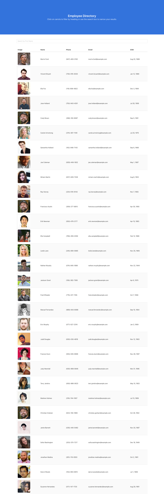

# Employee Directory

## Description
[Employee Directory](https://jeanarose.github.io/employee-directory/) is a React application designed to display employee data such as name, phone, email, date of birth, and a profile picture. Users can search for users by first name or sort by name, email, or DOB. Employee Directory is a useful application for collecting contact information in a simple and efficient way. Rather than emailing several coworkers to find an employee's contact information, a user can simply use Employee Directory instead.

This application took advantage of the following technologies:
* React functional components, class components, JSX expressions, state, and props
* Random User API
* Bulma

View the deployed app here: https://jeanarose.github.io/employee-directory/
## Employee Directory

## Table of Contents
* [Installation](#installation)
* [Usage](#usage)
* [Credits](#credits)
* [Tests](#tests)
* [Questions](#questions)
* [License](#license)

## Installation
1. Go to the [GitHub repository for Employee Directory](https://github.com/jeanarose/employee-directory).
2. Click the green **Code** button.
3. Copy the SSH key.
4. In your terminal, go into the directory that you want to host Employee Directory. 
5. Use the command **git clone [insert SSH key URL]** and click **Enter** (*Requires Git*).

## Usage
Employee Directory can be used for companies and organizations of any size to search for employees and find useful information for each. 

## Credits
The following people contributed to the success of this application. You can view their GitHub profiles by clicking on their names:
* [Jonathan Watson](https://github.com/jonathanjwatson)
* [Peter Colella](https://github.com/petercolella)

## Tests
Interested in testing Employee Directory?

* Ensure that you can sort by name and email from A to Z and from Z to A. 
* Ensure that you can sort by DOB from oldest to youngest and vice versa. 
* Ensure that you can sort by first name and that no results are shown if the characters do not match any users. 

## Questions
If you have any questions, you can contact me at jeanarose.mathis.dev@gmail.com. 
You can also view my GitHub profile at https://github.com/jeanarose.
## License
Copyright (c) 2021 Jeana Rose Mathis

MIT License
    
Permission is hereby granted, free of charge, to any person obtaining a copy
of this software and associated documentation files (the "Software"), to deal
in the Software without restriction, including without limitation the rights
to use, copy, modify, merge, publish, distribute, sublicense, and/or sell
copies of the Software, and to permit persons to whom the Software is
furnished to do so, subject to the following conditions:
    
The above copyright notice and this permission notice shall be included in all
copies or substantial portions of the Software.
    
THE SOFTWARE IS PROVIDED "AS IS", WITHOUT WARRANTY OF ANY KIND, EXPRESS OR
IMPLIED, INCLUDING BUT NOT LIMITED TO THE WARRANTIES OF MERCHANTABILITY,
FITNESS FOR A PARTICULAR PURPOSE AND NONINFRINGEMENT. IN NO EVENT SHALL THE
AUTHORS OR COPYRIGHT HOLDERS BE LIABLE FOR ANY CLAIM, DAMAGES OR OTHER
LIABILITY, WHETHER IN AN ACTION OF CONTRACT, TORT OR OTHERWISE, ARISING FROM,
OUT OF OR IN CONNECTION WITH THE SOFTWARE OR THE USE OR OTHER DEALINGS IN THE
SOFTWARE. 
  